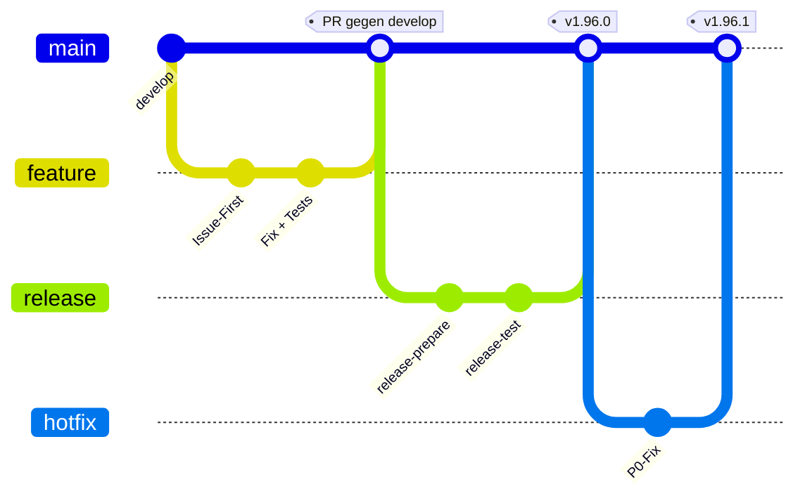
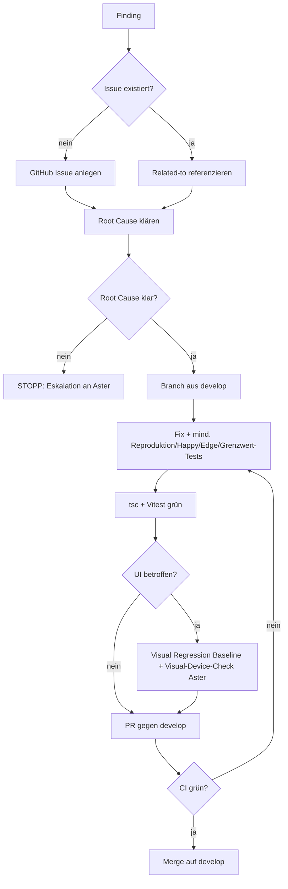
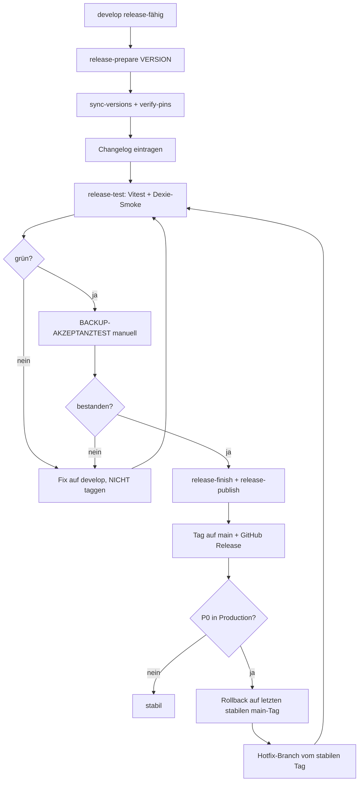
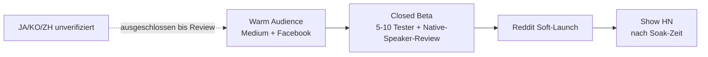

# Adaptive Learner Vorgehensweise (etabliert, Sessions 1-4)

## Rollen
* **Aster:** Architekt, manuelles Testen, Geräteverifikation, Entscheidungen, Human-in-the-Loop
* **Sparring Partner:** Prompts schreiben, Agenten koordinieren, Architektur-Beratung
* **CCW:** Frontend, Features, E2E, Visual Regression, Doku (Claude Code Web)
* **CC:** Backend, Infra, Launcher, Doku (Claude Code lokal)
* **CCWc:** Content-Repository-Agent (Lektionen, Sets, search-index.json)

## Workflow

**1. Finding -> Prompt -> Fix -> Weiter**
Kein Debattieren, kein Überanalysieren. Root Cause zuerst, dann implementieren.

**2. Issue-First (GITHUB-ISSUE-PFLICHT)**
GitHub Issue vor jedem Code. `gh issue list --search` für Duplikate. Related-to Referenzen nutzen. Gilt für alle Agenten (CC, CCW, CCWc). ISSUE-LIFECYCLE: Closes/Related im Commit. Bei Sub-Aufgaben Sub-Issue statt Umbrella-Issue (SUB-ISSUE-CLOSES).

**3. Begrenzte Autonomie-Direktive**
Keine Rückfragen bei bekannten Mustern. Alle Schritte in einem Pass. Entscheidungen basieren auf der Projektarchitektur, nicht auf Rückfragen. Testfehler autonom fixen, bevor gestoppt wird. Commits in logischen Blöcken, Endbericht am Schluss. Proaktive Prompt-Kettung ist erlaubt.
Stopp NUR bei echten Blockern: Abweichung von der EXP-Architektur, unklarer Root Cause, oder ein Defekt, der eine Architekturentscheidung erfordert. Fragen, die aus der bestehenden Architektur beantwortbar sind, lösen keinen Stopp aus. Kosmetisches Patchen über einem ungeklärten Defekt ist verboten.

**4. PR-Target: develop (NICHT main!)**
Gitflow Pflicht. `develop` ist Default-Branch und Integrationsziel. `main` NUR für Releases. Production deployt aus `main`, Preview/Staging aus `develop`. Release-Sperre: kein Code nach `develop`, wenn ein Release-Branch offen ist. No-Amend auf offenen PRs.

*Hinweis: `feature` und `hotfix` mergen konzeptionell nach `develop` bzw. zurück; das Diagramm zeigt den Fluss vereinfacht. `main` traegt ausschliesslich Release- und Hotfix-Tags.*

**5. Wiederverwendung vor Neuerstellung (Library-First & Verify-First)**
Native Language APIs -> Framework -> Library -> Selbst bauen (letzter Ausweg). Vor jeder Implementierung prüfen, ob Infrastruktur oder Code bereits existiert. Keine neuen Repos/Frameworks ohne Not.

**6. Half-Wired verboten**
Nie halb verdrahtete Features shippen. Entweder komplett oder gar nicht.

**7. Root Cause vor Fix**
Agenten neigen dazu, Fixes zu erfinden ohne die Ursache zu verstehen. Ehrliche Triage zuerst. Kein kosmetischer Fix über einem ungeklärten Defekt.

**8. Prio-Reihenfolge**
**Meta-Regel (WIP-Limit, gilt vor der Typ-Liste):** Offene, bereits begonnene PRs zuerst abschließen, bevor neue Arbeit beginnt. Erst fertigmachen, was offen ist, dann Neues anfangen. Senkt Cycle Time, verhindert angefangene-aber-nie-fertige Arbeit.
**Work-Item-Typen (in dieser Reihenfolge):** Hotfix (P0 Production) > Bug > Tech Debt/Infra > UI/UX > Cleanup > Feature > Release.
Stufen: P0 (Blocker) -> P1 (Bug) -> P2 (BF/UK) -> P3 (Nice-to-have) -> P4 (Vision). Keine Diskussion, direkt zuweisen.

**9. Prompts sofort liefern**
Wenn die Richtung klar ist: Prompt schreiben, nicht fragen. Entscheidungsfragen können danach geklärt werden.

**10. Kein Wunschkonzert**
Aster bestimmt den nächsten Task nach Prio und weist direkt zu. Nicht "was soll X machen?" fragen.

**11. EXP-Dokumente für Entscheidungen**
Jede signifikante Feature-/Architektur-Entscheidung bekommt ein nummeriertes EXP-Dokument (aktuell 34+). Design vor Code.

## Merge-Gate-Pipeline

Der Weg von einem Finding bis zum grünen Merge auf `develop`:

## Architektur-Regeln (AL-spezifisch)

* **DESIGN-TOKEN-ARCHITECTURE:** CSS-Variablen plus token-backed Tailwind. Keine Inline-Styles, keine Fixed-Palette, keine externen CSS-Module. `no-hardcoded-colors`-Guard.
* **TAILWIND-ONLY:** Styling ausschließlich über Tailwind-Utilities.
* **DEXIE-MODE-REGEL:** App läuft in zwei Storage-Modi (API + Dexie/IndexedDB). Beide Modi müssen jede Änderung tragen.
* **SYNC-UI-GATE:** Sync-Funktionen im Dexie-Modus ausgeblendet.
* **FUNKTION-NICHT-VERFÜGBAR:** Nicht verfügbare Funktionen ausblenden, nicht ausgrauen (kein Graying-out).
* **IStorageService Seam + guardedFetch:** Storage-Zugriff über das Seam, nicht direkt.
* **Repository Pattern:** Im Service-Layer. God-File- und God-Folder-Strukturen sind strikt verboten.
* **PluginForge/pluggy Hook-Architektur:** Für alle neuen Backend-Module.
* **R-M-W-Disziplin:** Atomare Dexie-Operationen (`db.transaction("rw")`, `table.modify()`), kein ungeschütztes get-spread-put. Unique Constraints auf user-skalierte Tabellen.
* **UI-Standards:** 44px Touch Targets, Barrel Exports (index.ts als Modul-API), `shared/` für wiederverwendbare Komponenten.

## Quality Gates

* **tsc + Vitest grün nach JEDEM Commit.**
* **Explicit `git add [paths]`** (kein `-A`). `git status` vor jedem Commit.
* **Kein `Co-Authored-By`.**
* **i18n: alle 11 Kataloge** (UI-Sprachen). Alle sichtbaren Strings über die Übersetzungsschicht, keine Hardcodes. Source of Truth sind die Backend-YAMLs, gespiegelt via `make sync-i18n`.
* **Echte UTF-8-Umlaute:** ä, ö, ü, ß. ae/oe/ue sind als Ersatz strikt verboten.
* **Ratchet-Guards:** Kohäsions-Watcher (WARN >500, ERROR >1000), File-Size-Baseline, Complexity-Gate (radon E/F, ESLint cx >20). madge 0 Zyklen.
* **Test Impact Analysis:** `vitest --changed` und `pytest --testmon` auf PRs. Volle Suite (5758+ FE, 1200+ BE) nachts plus bei Release.
* **CI-Nachtschicht:** Security-Scan (pip-audit, npm audit, bandit), Coverage, Dexie-Smoke, Complexity-Report nachts. Auf PRs nur Korrektheit.
* **axe-core a11y** plus ESLint bei 0 Warnings.

## Visual-Nachweis (zwei getrennte Mechanismen, beide Pflicht bei UI)

**A. Visual Regression (automatisiert):**
Playwright Visual Regression mit 60 Baselines. Bei UI-Änderung Baseline aktualisieren via `make capture-screenshots` in maschinen-konsistenter Umgebung (nicht im flüchtigen Container).

**B. Visual-Device-Check (manuell, nur Aster):**
Agenten können keine Browser öffnen. Jedes sichtbare/interaktive Feature wird VOR dem Merge manuell auf echtem Gerät geprüft: iPhone plus Desktop-Chrome/Brave. "CI grün heißt nicht Browser grün". Dieses Gate ist nicht durch automatisierte Screenshots ersetzbar.
**Bekanntes Skalierungsrisiko:** Der Device-Check liegt exklusiv bei Aster und wird mit wachsender Feature-Zahl zum Engpass im Merge-Fluss. Mitigation-Optionen: Cloud Device Farm, oder selektiver Device-Check (nur interaktive/layout-kritische Features, rein textuelle Änderungen ausgenommen). **Owner:** Aster. **Evaluation:** nach Abschluss der Closed Beta.

## Release-Gates & Rollback (vor jedem Tag)

* **BACKUP-AKZEPTANZTEST (manuell, nur Aster):** Echter Round-Trip-Beweis (Backup erstellen -> Browser-Daten komplett löschen -> Wiederherstellen -> Sets/Fortschritt/Settings/Theme prüfen, inkl. Cross-Mode GH-Pages -> Lokal) VOR backup-bezogenen Merges und vor Release.
* **E2E Smoke grün** vor Release-Tag.
* **Visual-Device-Check** der release-relevanten UI-Features.
* **Release-Reihenfolge:** alle Agenten-PRs gemergt -> Gates bestanden -> `release/x.y.z` schneiden (`make release-prepare` -> Changelog -> `release-test` -> `release-finish`).
* **Rollback-Strategie:** Bei P0-Fehlern in Production sofortiger Rollback auf den letzten stabilen `main`-Tag. Hotfix-Branch wird erst nach dem Rollback erstellt, vom stabilen Tag aus, und folgt demselben Gate-Satz wie ein regulärer Release.

## Plattform-Risiken (im Blick behalten)

* **iOS WKWebView:** IndexedDB kann unter Storage-Druck evakuiert werden. Mitigation: bestehender Export (Anki, Markdown, PDF).
* **PWA-first, keine Migration:** Capacitor/React Native/Kotlin sind NICHT der Weg. Bestehende PWA härten.

## Kommunikation

* Deutsch mit Aster.
* Englische Prompts an Agenten (echte UTF-8-Umlaute).
* Keine Em-Dashes, kein Hedging, keine Verbosität.
* Direkt, pragmatisch, keine Energie-Warnungen.
* Terse Direktiven ("ja", "go", "weiter" = fortfahren).
* Abkürzungen: S=Settings, UK=UX/UI-Konform, BF=Benutzerfreundlich, CLC=Clean Code, CC/CCW/CCWc für Agenten.

## Staged Launch (Disziplin)

Warm Audience (Medium + Facebook) -> Closed Beta (5-10 Tester + Native-Speaker-Content-Review) -> Reddit Soft-Launch -> Show HN (nach ausreichender Soak-Zeit). Unverifizierte Sprachsets (JA/KO/ZH) bis zum Native-Speaker-Review aus allen öffentlichen Pitches ausgeschlossen. Testzahlen allein sind kein Stabilitätsbeweis.

