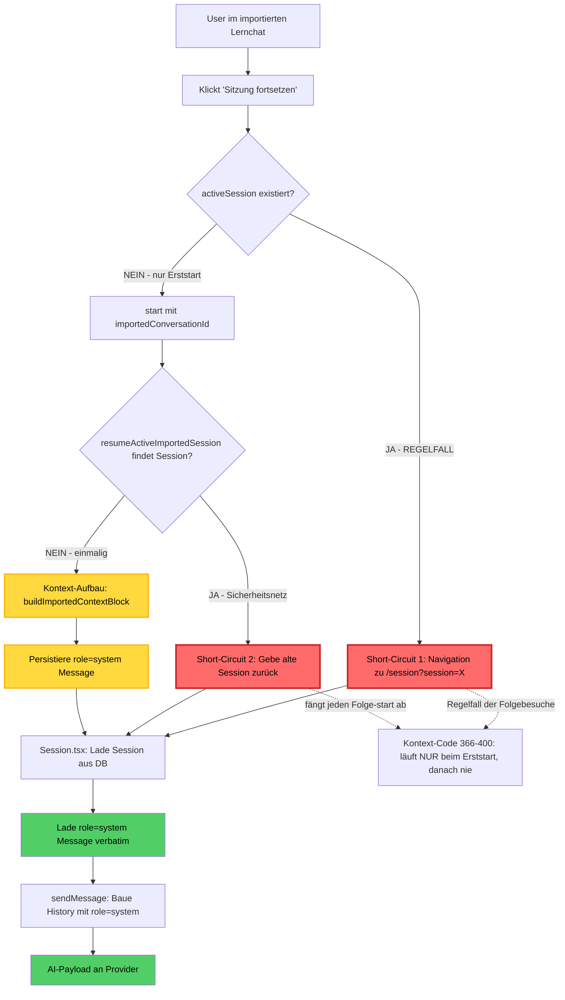
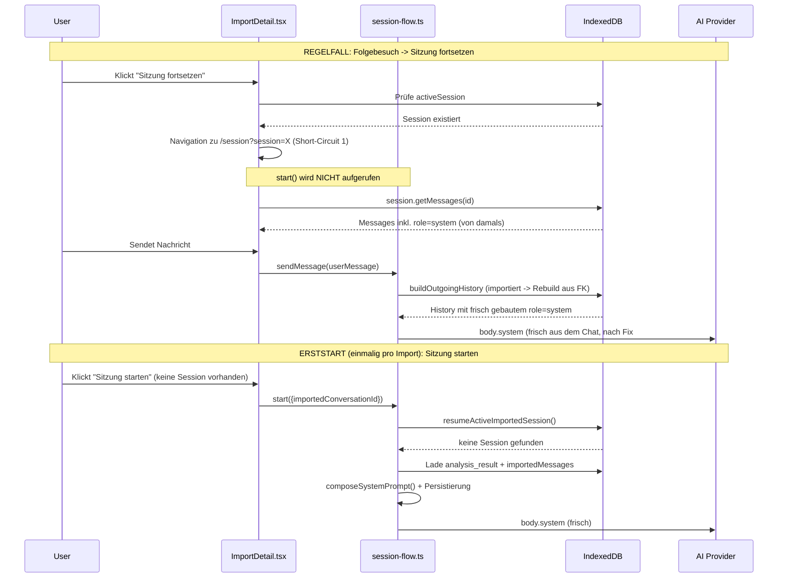

# Frozen-Prompt-Analyse: Kontext importierter Lernchats

> Entwickler-Referenz. Stand: 2026-06-25, verifiziert gegen `develop`
> mit lauffähigen Tests + Code-Greps. Zeilennummern beziehen sich auf
> diesen Stand; Funktionsnamen sind stabil. Pfade relativ zum
> Repository-Root.

> **Faktische Präzisierung (wichtig):** Eine verbreitete Verschärfung lautet
> „der Kontext-Aufbau-Code ist toter Code, wird nie erreicht". Das ist **nicht
> korrekt** und in diesem Dokument bewusst richtiggestellt: Der Code läuft
> **genau einmal** - beim allerersten Start, der die Session überhaupt erst
> erzeugt - und wird danach nie wieder erreicht. Beweis durch Widerspruch:
> Liefe er nie, gäbe es weder eine Session noch eine `role=system`-Message
> zum Fortsetzen. Die korrekte Diagnose ist „einmalig gebaut, dann
> eingefroren", nicht „tot".

## 1. Executive Summary

Bei einem importierten Lernchat ist **"Sitzung fortsetzen"** der Regelpfad:
Sobald eine Session für die Konversation existiert, navigiert ein Klick nur
noch zur bestehenden Session (Short-Circuit 1). Der Kontext (Analyse #827,
Roh-Transkript #1078, Lernfortschritt #797) wird ausschließlich beim
**allerersten** Start gebaut und als `role=system`-Nachricht eingefroren.

**Kernaussage:** Für jede importierte Session existiert der Kontext-Aufbau
nur als einmaliges Erst-Ereignis. Jedes spätere "Fortsetzen" lädt die
eingefrorene Nachricht wortwörtlich und baut nichts neu (Short-Circuit 1 auf
UI-Ebene, Short-Circuit 2 als Sicherheitsnetz in der Logik).

**Impact:** Eine importierte Session trägt entweder gar keinen Kontext (wenn
sie vor dem jeweiligen Fix erzeugt wurde) oder den beim Erststart
eingefrorenen Kontext. Verbesserungen an `prompts.ts` /
`buildImportedContextBlock` wirken nur für **neu** importierte Chats beim
ersten Start - nie rückwirkend für bestehende Sessions. "Eingefroren" ist
dabei nicht "verloren": der alte Prompt erreicht den Provider weiterhin
(Abschnitt 3.5).

## 2. Architektur-Überblick



Legende: **Rot** = Short-Circuit. **Gelb** = Kontext-Aufbau + Persistierung
(läuft einmalig beim Erststart). **Grün** = verbatim-Laden + Versand des
eingefrorenen Prompts.

## 3. Der Regelpfad: "Sitzung fortsetzen"

### 3.1 Ausgangssituation

Der User hat einen Lernchat importiert (Analyse + Roh-Transkript liegen in der
DB), die Import-Detail-Seite zeigt den Button, und eine `activeSession`
existiert bereits (beim Erststart erzeugt). Der Button-Text richtet sich nach
`activeSession`: `frontend/src/components/import/ImportActionBar.tsx:177`
schaltet die Test-ID zwischen `continue-session-button` und
`start-session-button`.

### 3.2 Schritt 1: UI-Layer

- **Datei/Zeilen:** `frontend/src/pages/content/ImportDetail.tsx:370-377`
  (Funktion `startOrResumeSession`)

```ts
if (activeSession) {
  go(`/session?session=${encodeURIComponent(activeSession.id)}`);
  return;  // <-- start() wird NICHT aufgerufen
}
```

`activeSession` wird beim Laden über `getActiveForConversation(...)` befüllt
(`ImportDetail.tsx:214`). **Erkenntnis:** Dies ist der Regelfall für jeden
Folgebesuch; der gesamte Kontext-Code wird übersprungen.

### 3.3 Schritt 2: Navigation

React Router navigiert zu `/session?session=<id>`;
`frontend/src/pages/lesson/Session.tsx` wird geladen (Resume-Modus, erkannt am
`?session=`-Parameter).

### 3.4 Schritt 3: Session-Laden

- **Datei/Zeilen:** `frontend/src/pages/lesson/Session.tsx:192-208`

```ts
const resumeId = searchParams.get("session");
if (resumeId) {
  Promise.all([
    getStorage().session.get(resumeId),
    getStorage().session.getMessages(resumeId),  // role=system verbatim
  ]).then(([existingSession, history]) => { setSession(...); setMessages(...); });
}
```

`getMessages` (`frontend/src/storage/dexie/dexie-session.ts:358-377`) liefert
alle Messages unverändert; die `role=system`-Message ist die beim Erststart
persistierte Version.

### 3.5 Schritt 4: Message-Senden

- **Datei/Zeilen:** `frontend/src/storage/ai/session-flow.ts` (`sendMessage`,
  History-Bau via `buildOutgoingHistory`)

```ts
const history = await buildOutgoingHistory(db, sess, project);
```

Vor dem Fix enthielt die History die eingefrorene `role=system`-Message
unverändert; der Anthropic-Adapter sammelt sie in `body.system`
(`frontend/src/storage/ai/ai-providers.ts:150-158`). **Ergebnis vor dem Fix:**
Die AI erhielt den Kontext - aber die eingefrorene Fassung von damals.
"Eingefroren" heißt nicht "fehlt". Nach dem Fix (Abschnitt 9.1) wird die
ausgehende System-Message für importierte Sessions frisch gebaut.

## 4. Der Erststart: einziger Moment des Kontext-Aufbaus

"Sitzung starten" (Klick bei fehlender `activeSession`) ist kein paralleler
Vorgang, sondern der **einmalige Erzeuger** der Session. Es ist die einzige
Stelle im Code, die eine importierte Session anlegt - verifiziert: der einzige
`start()`-Aufruf mit `imported_conversation_id` steht in
`frontend/src/pages/content/ImportDetail.tsx:389-392`.

### 4.1 Wann er auftritt

- Genau beim ersten Öffnen einer importierten Konversation, die noch keine
  Session hat (oder nach manuellem Löschen der Session).
- Danach nie wieder für dieselbe Konversation.

### 4.2 Short-Circuit 2 als Sicherheitsnetz

- **Datei/Zeilen:** `frontend/src/storage/ai/session-flow.ts:305-311`
  (`startSession`) + `:224-243` (`resumeActiveImportedSession`)

```ts
if (opts.importedConversationId) {
  const resumed = await resumeActiveImportedSession(db, opts.importedConversationId);
  if (resumed) return resumed;  // alte Session + eingefrorener Prompt
}
```

Selbst wenn `start()` ein zweites Mal aufgerufen würde, fängt
`resumeActiveImportedSession` den Aufruf ab, sobald eine Session existiert.

### 4.3 Der Kontext-Aufbau (läuft genau einmal)

- **Datei/Zeilen:** `frontend/src/storage/ai/session-flow.ts` (`startSession`
  via `composeSystemPrompt`)
- `buildImportedContextBlock` (`session-flow.ts:255-279`) liest
  `analysis_result` + `importedMessages`, das Ergebnis wird in `systemPrompt`
  gefaltet und als `role=system`-Message persistiert.
- **Status:** **Kein toter Code.** Er wird beim Erststart **genau einmal**
  erreicht - der Moment, der die Session und damit den (anfänglich
  persistierten) Prompt erst erzeugt. Hinter beiden Short-Circuits ist er für
  **Folge**besuche unerreichbar, nicht generell.

## 5. Die zwei Short-Circuits (Root Cause)

### 5.1 Short-Circuit 1 (UI) - der Regelfall der Folgebesuche

`frontend/src/pages/content/ImportDetail.tsx:370-377`. Fängt jeden Besuch ab,
bei dem bereits eine `activeSession` existiert (also alle außer dem
Erststart). Reine Navigation, kein `start()`.

### 5.2 Short-Circuit 2 (Logik) - das Sicherheitsnetz

`frontend/src/storage/ai/session-flow.ts:305-311` + `:224-243`. Verhindert
Duplikate, falls `start()` trotz bestehender Session aufgerufen wird, und gibt
den persistierten Prompt verbatim zurück.

Zusammen sorgten beide dafür, dass der Kontext-Aufbau nach dem Erststart nie
wieder lief - die Grundlage des eingefrorenen Prompts.

## 6. Datenfluss-Diagramm: Regelfall vs. Erststart



## 7. Auswirkungen auf Fixes

### 7.1 Warum "N-mal gefixt, immer noch kaputt"

- Fixes wie #827, #1078, #797 verbessern `prompts.ts` /
  `buildImportedContextBlock` - Code, der vor dem Fix nur beim **Erststart**
  lief.
- Bestehende importierte Sessions wurden bereits früher eingefroren; Short-
  Circuit 1 (+ 2) verhinderte jede Neuberechnung beim Fortsetzen.
- **Test-Artefakt:** Wer dieselbe importierte Konversation (mit bestehender
  Session) erneut testet, traf immer den eingefrorenen alten Prompt und sah
  den Fix nie - obwohl ein **frischer** Import beim Erststart korrekt
  funktionierte.

### 7.2 Die harte Konsequenz (vor dem Fix)

- Für **bestehende** importierte Sessions waren `prompts.ts`-Fixes wirkungslos.
- Wirksam wurden sie nur für **neu** importierte Chats beim Erststart - nicht
  rückwirkend.
- Das ist die eigentliche Schärfe: nicht "toter Code", sondern "einmal
  eingefroren, nie aktualisiert". Der Fix in Abschnitt 9.1 hebt das auf.

## 8. Verifikations-Methoden

### 8.1 Manuelle Live-Inspektion

1. DevTools -> Application -> IndexedDB -> App-DB -> `sessionMessages`.
2. `role=system`-Message einer importierten Session suchen.
3. Prüfen, ob sie `=== Imported conversation (previous chat) ===` (DE:
   `=== Importierte Konversation (vorheriger Chat) ===`) enthält.
4. Mit dem aktuellen `buildConversationContext` in `prompts.ts` abgleichen.
5. Build-Hash im About-Tab gegen Commit `22e11c76` (#1078) prüfen - älter
   bedeutet, das Roh-Transkript-Feature ist im Deploy nicht aktiv.

### 8.2 Automatisierte Tests (aktuell im Repo)

| Test | Datei | Prüfung |
|---|---|---|
| Persistenz beider Blöcke | `frontend/src/storage/ai/context-persistence.test.ts` | Erststart legt Analyse + Roh-Transkript in einer `role=system`-Message ab |
| FROZEN | `frontend/src/storage/ai/context-persistence.test.ts` | Zweit-`start()` -> gleiche Session, byte-identischer Prompt; geänderte Analyse erreicht den persistierten Prompt nicht |
| Roh-Transkript erreicht AI (#1078) | `frontend/src/storage/ai/session-flow.test.ts` | Nach Resume trägt `body.system` beide Roh-Turns |
| REBUILD-ON-RESUME (#1122) | `frontend/src/storage/ai/session-flow.test.ts` | Mutierte Analyse + gelöschte `role=system`-Message -> frischer Kontext erreicht den Provider |
| SC1 (UI) | `frontend/src/pages/content/ImportDetail.test.tsx` | Aktive Session -> nur Navigation, `start()` nicht aufgerufen; keine Session -> `start({imported_conversation_id})` |

> Hinweis: Frühere Iterationen nutzten `frozen-prompt-resume.test.ts` /
> `frozen-prompt-ui.test.tsx`. Diese wurden in die obigen, dauerhaften Pins
> integriert und existieren nicht mehr.

## 9. Lösungsansätze

### 9.1 Rebuild-on-Resume aus der Konversations-FK (IMPLEMENTIERT, #1122)

> Status: umgesetzt in `fix/imported-session-rebuild-context-1122`. Die
> Komposition wurde in `composeSystemPrompt` extrahiert; `sendMessage` /
> `sendMessageStream` bauen die ausgehende System-Message für importierte
> Sessions über `buildOutgoingHistory` frisch aus der FK. Die **Persistierung
> bleibt bewusst unverändert** (die gespeicherte `role=system`-Message ist nur
> noch der Seed), daher bleibt der FROZEN-Persistenztest gültig und wird NICHT
> invertiert. Neuer Pin: "REBUILD-ON-RESUME (#1122)" in `session-flow.test.ts`
> (mutierte Analyse + gelöschte System-Message -> frischer Kontext erreicht
> den Provider).

- **Idee:** Kontext nicht aus der eingefrorenen `role=system`-Message ziehen,
  sondern bei jeder Nachricht frisch aus der **Quelle** ableiten - dem
  importierten Chat selbst. Diese Quelle ist immer verfügbar: der Chat liegt
  in `importedMessages` (gekeyt per `conversation_id`) und die Analyse in
  `importedConversations.analysis_result`, und die Session trägt den FK
  `imported_conversation_id` (`session-flow.ts:336`, zurückgegeben in
  `rowToSessionDto` `:102`).
- **Mechanismus:** In `sendMessage` / `sendMessageStream` bei vorhandenem
  `sess.imported_conversation_id` den Block frisch über
  `buildImportedContextBlock(db, sess.imported_conversation_id, lang)`
  (`:255-279`) erzeugen und der History voranstellen - statt sich auf die
  persistierte System-Message zu verlassen.
- **Deckt den Kernfall ab:** Selbst wenn keine `role=system`-Message gefunden
  wird (alte Session, vor dem Fix erzeugt, oder leer), wird der vorhandene Chat
  genommen. Genau das ist die Anforderung "auch wenn nichts in der DB gefunden
  wird, dann den Chat nehmen". Auf der UI-Seite liegt derselbe Chat ohnehin im
  Speicher (`ImportDetail.tsx` `detail.messages` + `detail.analysis_result`),
  was den Ansatz bestätigt; der robustere Ort ist aber die Storage-Schicht
  über den FK, weil er für jeden Resume-Weg und beide Storage-Modi greift.
- **Vorteil:** Jeder zukünftige Fix wirkt sofort für alle Sessions; das
  Stale-Session-Artefakt verschwindet; aktualisierte Analyse / Roh-Turns
  fließen laufend ein.
- **Nachteil:** Etwas mehr Rechenzeit pro Nachricht; Doppel-Injektion
  vermeiden (entweder die persistierte System-Message nicht mehr mitsenden,
  oder den frischen Block deduplizieren - hier wird die alte System-Message aus
  der ausgehenden History gefiltert).
- **Folge für Tests:** Da die Persistierung unverändert bleibt, bleibt der
  FROZEN-Persistenztest gültig (nicht invertiert). Der neue Pin
  "REBUILD-ON-RESUME (#1122)" in `session-flow.test.ts` deckt die Fälle
  mutierte Analyse + fehlende `role=system`-Message ab.

### 9.2 Short-Circuit 1 erweitern (verworfen zugunsten 9.1)

- **Idee:** Beim "Sitzung fortsetzen" nicht nur navigieren, sondern ein
  Kontext-Update der `role=system`-Message anstoßen.
- **Ort:** `frontend/src/pages/content/ImportDetail.tsx:370-377`.
- **Nachteil:** UI-Logik wird komplexer; löst das Problem nur für den UI-Pfad,
  nicht für andere Resume-Wege. 9.1 ist allgemeiner.

### 9.3 Prompt-Versionierung (verworfen)

- **Idee:** Versionsnummer im persistierten Prompt; bei Mismatch neu bauen.
- **Nachteil:** Mehr Komplexität, Migration - ohne Mehrwert gegenüber 9.1.

## 10. Referenzen

### 10.1 Relevante Dateien

- `frontend/src/pages/content/ImportDetail.tsx`
- `frontend/src/storage/ai/session-flow.ts`
- `frontend/src/pages/lesson/Session.tsx`
- `frontend/src/storage/dexie/dexie-session.ts`
- `frontend/src/storage/ai/prompts.ts`
- `frontend/src/storage/ai/ai-providers.ts`
- `frontend/src/components/import/ImportActionBar.tsx`

### 10.2 Verwandte Issues/PRs

- #827: Analyse-Block
- #1078: Roh-Transkript (Commit `22e11c76`, 2026-06-24)
- #797: Lernfortschritts-Kontext
- #1122: Frozen-Prompt beim Fortsetzen (dieser Fix)

### 10.3 Test-Dateien

- `frontend/src/storage/ai/context-persistence.test.ts`
- `frontend/src/storage/ai/session-flow.test.ts`
- `frontend/src/pages/content/ImportDetail.test.tsx`
